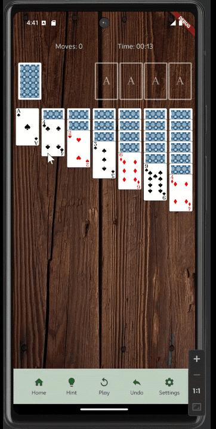
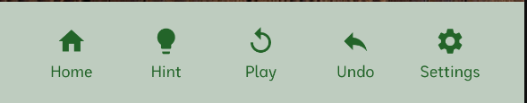
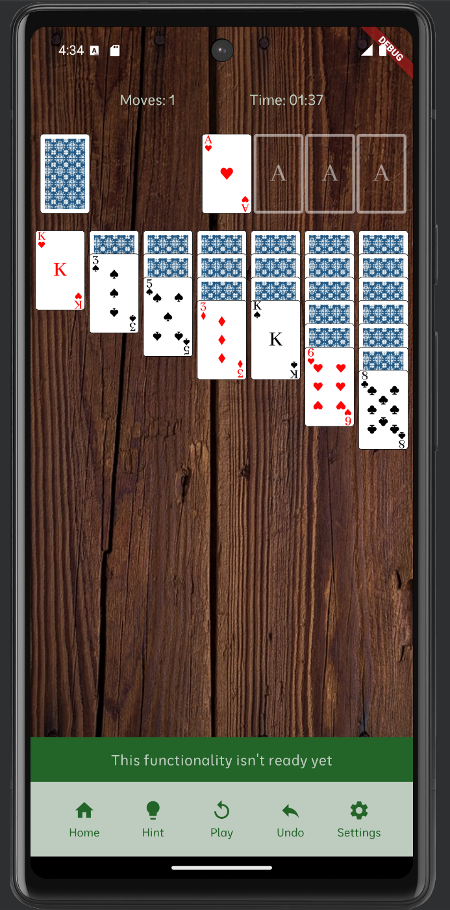
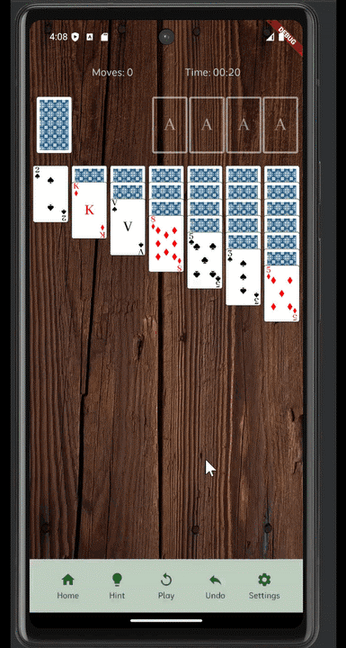
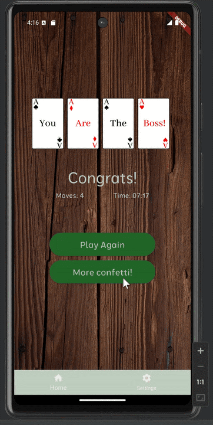

# Solitaire game

This app is a solitaire game. Some functionalities are available and will be detailed further below.

## Table of content

- [Moving the cards](#moving-the-cards)
- [Tool bar](#tool-bar)
- [Saving the game](#saving-the-game)
- [Info on the game](#info-on-the-game)
- [Victory](#victory)

## Moving the cards

The game only allows drag and drop to move a card from a place to another.
All the visible cards are draggable and each one is also a target onto which a card can be added.
It is possible to remove cards from the stacks.

## Tool bar

At the bottom of the board, a tool bar provides some functionalities.
From left to right: an access to the home page, an hint, a replay button, a undo and an access to
the settings.

The first and last buttons are navigation buttons. As the settings page is not built yet,
this button only shows a snack bar. The hint functionality isn't ready either, and also shows a
snack bar.

The replay button generates a new game. The undo action rebuilt the board at the state it was before
the last move done.

## Saving the game

All effective moves are saved. Each time the board is left - either when you close the app or when
you go back to the home menu - the board state is saved using SharedPreferences.
It is possible to get back to your game using the button "Continue Game" on the home screen.
If no previous game is saved, this button shows a snack bar and is disabled.

## Info on the game

Two different infos are displayed while you play and are resumed on the victory screen:
the number of moves and the time spent on the game. It is saved each time you leave the game and is
resumed when you come back to your play.

## Victory

When you win, you get to the victory screen. There, a button allows you to get confetti to celebrate
your victory ! Have fun !

